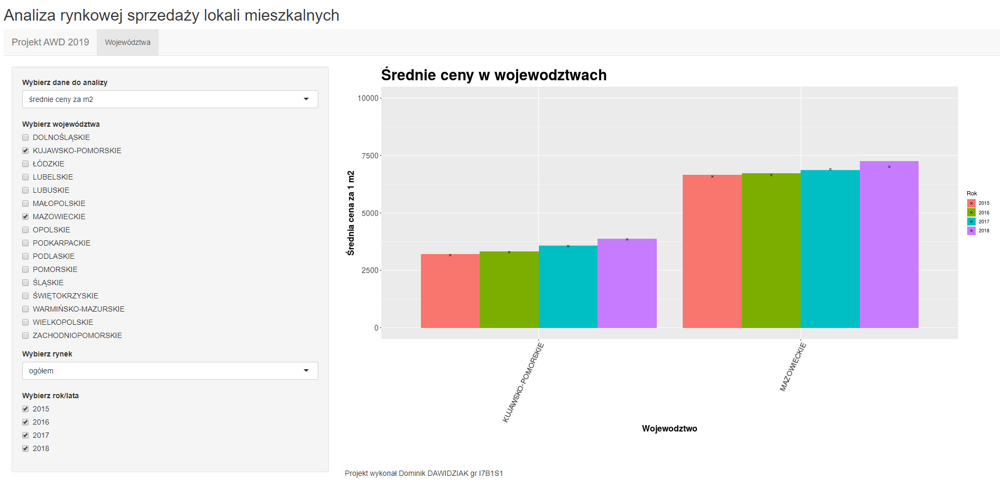

###### Dominik DAWIDZIAK gr I7B1S1

# Projekt semestralny z przedmiotu Analiza i Wizualizacja Danych

#### Analiza rynkowej sprzedaży lokali mieszkalnych 

##### Dane GUS 2019

Aplikacja pozwala na intuicyjną, prostą i dynamiczną modyfikację zestawów danych do wizualizacji (województwa, rynku, metrażu mieszkania, roku) 

[LINK]: https://ddawidziak.shinyapps.io/AWD-Projekt-2019-dawidziak/	"tutaj sprawdzisz jak działa aplikacja"

